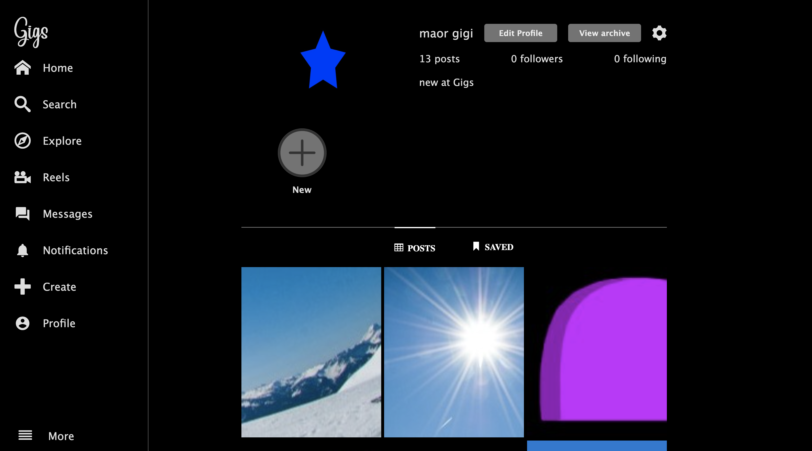

# GigsPicks


## Description
GigsPicks is a social media platform designed to help users discover and share exciting gigs, concerts, and live events. Connect with friends, follow your favorite artists, and never miss a show again!

## Table of Contents
- [Features](#features)
- [Installation](#installation)
- [Usage](#usage)
- [Screenshots](#screenshots)
- [Contributing](#contributing)
- [License](#license)
- [Contact](#contact)

## Features (Current)
- Sign up and create a profile.
- Browse the home feed for upcoming gigs.
- Share and discuss events with friends through posts and chats.
- Update profile image.
- View other users' profiles.

## Installation
*Note: GigsPicks is currently under development. Installation steps are for setting up the development environment.*

1. Clone the repository:
    ```bash
    git clone https://github.com/maorgigi123/gigspicks.git
    ```

2. Navigate to the project directory:
    ```bash
    cd gigspicks
    ```

3. Install dependencies:
    ```bash
    npm install
    ```

<!-- 4. Set up the environment variables:
    - Create a `.env` file in the root directory.
    - Add your API keys and other configuration details:
      ```env
      DATABASE_URL=your_database_url
      API_KEY=your_api_key
      ``` -->

4. Run the development server:
    ```bash
    npm start
    ```

## Usage
Here's a basic example of how to use GigsPicks:

1. Sign up and create a profile.
2. Browse the home feed for upcoming gigs.
3. Share and discuss events with friends through posts and chats.
4. Update your profile image.
5. View other users' profiles.

## Screenshots

*Caption: Home Feed showcasing upcoming gigs.*


*Caption: Profile User Feed showcasing upcoming gigs.*

## Contributing
We welcome contributions! Please follow these steps to contribute:

1. Fork the repository.
2. Create a new branch (`git checkout -b feature/your-feature`).
3. Make your changes.
4. Commit your changes (`git commit -m 'Add some feature'`).
5. Push to the branch (`git push origin feature/your-feature`).
6. Open a pull request.

Please read our [CONTRIBUTING.md](CONTRIBUTING.md) for more details on our code of conduct and the process for submitting pull requests.

## License
This project is licensed under the MIT License - see the [LICENSE.md](LICENSE.md) file for details.

## Contact
maor gigi - [protoflio](https://gigscoder.com/) - gigigamescompany@gmail.com

Feel free to reach out if you have any questions or need further assistance.

